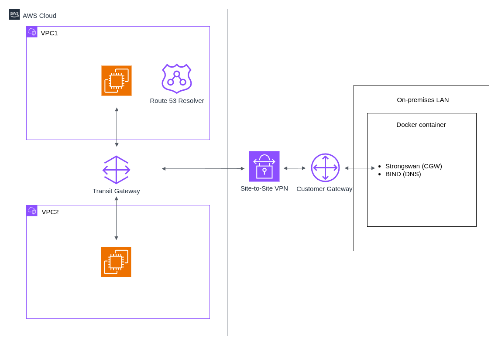

# Hybrid Cloud

## Overview

The aim of this project is to create a reference implementation for hybrid cloud architecture in AWS where private AWS services will be connected to a simulated on-premises network. The architecture on the AWS side consists of two private VPCs connected via a Transit Gateway. The Transit Gateway will have a Site-to-Site VPN attachment which connects to a Customer Gateway Device on the on-premises side and establishes two secure IPsec tunnels (facilitated using Strongswan). The on-premises network will be run on a Docker container and will run BIND using `named` for local DNS resolution. DNS inside the AWS network will be resolvable from the on-premises network. This is achieved using a Route 53 Resolver Endpoint.

EC2 instances will be deployed in each of the VPCs to smoke test ICMP and DNS network connectivity between VPCs and between the VPC and VPN. VPC Endpoints for SSM are created to ensure that Session Manager can be used to access the private instances without the need for SSH keys.

## Architecture

- Two private VPCs connected via Transit Gateway

- Site-to-Site VPN terminating on a containerized Customer Gateway (StrongSwan)

- On-prem DNS provided by BIND, forwarding AWS zones to Route53 Resolver inbound endpoints

- Private EC2 instances accessed via SSM



## Prerequisites

Docker, Terraform, user or role-based access to an AWS account (with permission to create the resources outlined above and local AWS CLI access).

## Quick Start

To deploy AWS infrastructure make sure root .env vars are set and run the following commands from the repository root:

```
make arch=hybrid-cloud

make apply arch=hybrid-cloud
```

This will deploy the architecture to your locally authenticated AWS account (Note: you must have either temporary or user AWS credential saved to your local configuration files or exported as local environment variables - see [Configuration and credential file settings in the AWS CLI](https://docs.aws.amazon.com/cli/v1/userguide/cli-configure-files.html))

Once this infrastructure has been provisioned download the VPN configuration file from the AWS console (see [Download the configuration file](https://docs.aws.amazon.com/vpn/latest/s2svpn/SetUpVPNConnections.html#vpn-download-config)) and add the corresponding values to architectures/hybrid-cloud/onprem/.onprem.env (Tunnel 1 `Pre-Shared Key` to `T1_PSK` & `Outside IP Addresses: Virtual Private Gateway` to `T1_AWS_OUTSIDE_IP` & Tunnel 2 `Pre-Shared Key` to `T2_PSK` & `Outside IP Addresses: Virtual Private Gateway` to `T2_AWS_OUTSIDE_IP`).

Other .onprem.env environement variables that must be set are:

- `R53_RSLV_INBOUND_ENDPOINT_IP` & `R53_RSLV_INBOUND_ENDPOINT_IP2` - the IPs of your Route 53 Resolver Endpoints which can be found in the terraform output.

- `CGW_LAN_IP` & `CGW_LAN_CIDR` - your LAN device IP and network CIDR (run `ip a` on linux or `ifconfig -a` on mac).

- `VPC1_CIDR` & `VPC2_CIDR` - the CIDRs of the VPCs which are set in the terraform variables.

Once this is done run `make onprem-up` to bring up the containerized simulated on-premises network.

## Deployment Validation

To test the inter-connectivity between the AWS network and connectivity between AWS and the on-premises network run `make test arch=hybrid-cloud`. This will run a series of smoke tests to confirm that connectivity has been established between the EC2 instances and the on-premises Customer Gateway Device (using AWS SSM), and that you are able to resolve private AWS DNS from the on-premises network.

## Note

The Site-to-Site VPN, Transit Gateway, Route 53 Endpoints and SSM VPC Endpoints will incur a cost until they are destroyed (approximately £0.30/hour) - remember to destroy this infrastructure after use `make destroy arch=hybrid-cloud`.
